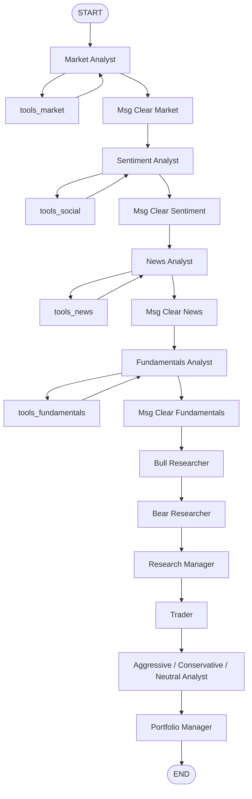

# TradingAgents 原生 LangGraph 调用与 PanWatch 注入、阶段监听

## 摘要

TradingAgents 本身不是一个“调用一次模型、返回一段文本”的 Agent。它在
`TradingAgentsGraph` 内部构建了一张 LangGraph 状态图：分析师节点负责读取工具数据并产出报告，
研究节点负责看多/看空辩论，随后经过交易员、风险分析师和 Portfolio Manager，最后输出完整状态与
评级。

PanWatch 没有 fork 这张图，也没有把上游节点改成自己的实现。当前项目采用运行时适配：

1. 先由 PanWatch Provider 体系采集行情、K 线、资金流、事件和财报；
2. 用 `ContextVar` 把这份快照注入 TradingAgents 工具调用上下文；
3. 对 A 股/港股需要接管的工具调用做路由补丁，对美股保留上游 vendor 或受控兜底；
4. 通过 LangChain callback 和 LangGraph callback 同时监听 LLM、工具和图节点；
5. 将日志聚合成进度快照，由 SSE/轮询传给前端弹窗。

本文以 TradingAgents 0.5.0 和当前 PanWatch 实现为准，重点解释调用链、数据注入和阶段监听，
不讨论投资策略本身。

## 一、原生 TradingAgents 0.5.0 是怎样调用 LangGraph 的

### 1. 组件关系

上游主要由四部分组成：

| 组件 | 作用 |
| --- | --- |
| `TradingAgentsGraph` | 对外暴露统一入口，创建 LLM、工具节点、状态图和传播器 |
| `GraphSetup` | 把分析师、辩论、交易、风控、PM 节点和边装配成 `StateGraph` |
| `Propagator` | 创建初始状态，并生成 `graph.invoke/stream` 所需的参数 |
| LangGraph compiled graph | 真正按照节点和条件边推进状态 |

0.5.0 的典型调用如下：

```python
from tradingagents.graph.trading_graph import TradingAgentsGraph

graph = TradingAgentsGraph(
    selected_analysts=["market", "social", "news", "fundamentals"],
    debug=False,
    config={
        "llm_provider": "openai",
        "deep_think_llm": "gpt-5.5",
        "quick_think_llm": "gpt-5.5",
        "max_debate_rounds": 1,
        "max_risk_discuss_rounds": 1,
    },
)

final_state, rating = graph.propagate(
    "300624",
    "2026-09-20",
    portfolio=None,
)
```

返回值不是单独一段报告，而是：

- `final_state`：包含各分析师报告、辩论状态、交易员结论、风险讨论和最终决策的状态字典；
- `rating`：经过上游信号处理后的评级，例如 `Buy`、`Hold`、`Sell` 或需要人工复核的 `REVIEW`。

### 2. 图节点和执行顺序

实际节点名称来自上游 `GraphSetup`。选择的分析师会按配置顺序执行，之后进入研究辩论、交易和风险链路：



上图是便于阅读的简化图。辩论和风险节点都有条件边，实际运行中可能在同一类节点之间循环多轮。
因此，“第 16 次 LLM 调用”不能直接理解成“第 16 个子 Agent”；它只是当前运行中的第 16 次模型调用。

### 3. `propagate()` 内部如何进入 LangGraph

`TradingAgentsGraph.propagate()` 大致做四件事：

1. 校验交易日期并准备 checkpoint；
2. 通过 `Propagator.create_initial_state()` 生成初始状态；
3. 调用 `Propagator.get_graph_args()` 取得 LangGraph 参数；
4. 非 debug 模式调用 `self.graph.invoke(graph_input, **args)`，debug 模式调用
   `self.graph.stream(graph_input, **args)`。

0.5.0 的传播器默认返回：

```python
{
    "stream_mode": "values",
    "config": {
        "recursion_limit": 100,
        # 有 callback 时还会放入 callbacks
    },
}
```

这带来一个重要边界：

- 传给 `TradingAgentsGraph(..., callbacks=[handler])` 的 callback，主要能收到 LLM 和工具侧事件；
- 如果想收到 LangGraph 节点的 `on_chain_start/on_chain_end`，还必须把 callback 放到图调用的
  `config.callbacks` 中。

## 二、PanWatch 的整体运行时适配

PanWatch 的适配入口是
[`src/modules/automation/tradingagents/agent.py`](../src/modules/automation/tradingagents/agent.py)。
它仍然遵循 PanWatch 的 `BaseAgent` 生命周期：

```text
run()
 ├─ collect(context)       # PanWatch 数据采集
 └─ analyze(context, data)  # TradingAgents 图执行
```

### 1. 先采集，再运行图

`collect()` 不直接让 TradingAgents 自己访问行情网站，而是通过
`get_market_data()` 并发采集：

- quote：当前行情；
- klines：足够计算验证快照和技术指标的历史 K 线；
- capital_flow：资金流；
- events：事件；
- CN 标的额外采集 financial；
- 最后基于同一份 K 线计算 technical。

采集结果会组成一个快照字典：

```python
{
    "stock": stock,
    "quote": quote_dict,
    "klines": klines_list,
    "capital_flow": capital_list,
    "events": events_list,
    "financial": financial,
    "technical": technical,
    "fetched_at": "...",
}
```

这一步的意义是把“数据准备”和“图内推理”拆开：图内的多个节点可以复用采集结果，避免每个工具
重复向东财、腾讯或其它 vendor 请求 750 日 K 线。

### 2. 用 `ContextVar` 注入数据快照

适配层在
[`src/modules/automation/tradingagents/toolkit_adapter.py`](../src/modules/automation/tradingagents/toolkit_adapter.py)
中提供 `panwatch_data_context()`。它把 `stock/quote/klines/...` 放进当前异步上下文，并在
`asyncio.to_thread()` 创建的 worker 线程中保持隔离。

```python
with panwatch_data_context(
    panwatch_data,
    trace_id=trace_id,
):
    # TradingAgents 的同步图运行在这里
    final_state, rating = graph.propagate(symbol, date_str, portfolio=portfolio)
```

这里不用全局可变字典的原因是：多个标的可能并发分析。全局字典会导致 A 股票的 K 线被 B 股票的
工具调用读取；`ContextVar` 可以让每个任务看到自己的快照。

### 3. patch `route_to_vendor`

上游工具通常通过：

```text
TradingAgents tool
  -> route_to_vendor(method, *args, **kwargs)
  -> yfinance / alpha_vantage / other vendor
```

PanWatch 在 `patch_route_to_vendor()` 中安装进程级兼容补丁，但真正的数据通过当前
`ContextVar` 查找。核心判断是：

1. 从工具参数中解析 symbol；
2. 判断它是否为 PanWatch 需要接管的 A/HK 标的；
3. 如果快照中已有数据，直接返回与上游工具约定兼容的文本或结构；
4. 未实现的方法记录 `MISS`，非 PanWatch 标的则允许上游 vendor 继续处理；
5. 取消或超时后的 worker 在发起下一次请求前检查协作取消信号。

因此，注入不是把 TradingAgents 的所有工具替换成 PanWatch API，而是在上游稳定的 vendor 路由边界
上做选择性接管。

### 4. patch `load_ohlcv`

`load_ohlcv(symbol, curr_date, ...)` 是技术指标工具的重要入口。PanWatch 的补丁优先执行：

```text
当前上下文有同标的 K 线快照
    -> 直接构造 Date/Open/High/Low/Close/Volume DataFrame
否则
    -> KlineCollector 拉取 750 日 K 线
```

同标的判断是必要的，不能把 300624 的快照冒充成模型误传的其它 symbol。采集阶段明确返回空列表时，
后续也不再因为“空列表是 false”而重复请求同一标的。

美股默认保留上游 yfinance 路径；PanWatch 的市场数据配置在存在 Stooq/Yahoo K 线兜底时跳过当前网络
环境下稳定返回 501 的腾讯美股探测，避免无意义的多供应商失败日志。

### 5. 原生 `portfolio` 与标的元信息分离

TradingAgents 0.5.0 提供原生：

```python
graph.propagate(symbol, date_str, portfolio=PortfolioContext(...))
```

PanWatch 使用
`to_tradingagents_portfolio()` 将多账户现金、仓位、成本和交易风格聚合成上游
`PortfolioContext`。这样 Trader、风险分析师和 Portfolio Manager 都能收到结构化仓位信息。

`past_context` 不再承担用户持仓注入，只保留股票名称、市场、实时价、行业等标的元信息。这样可以
区分“历史经验/记忆”和“当前组合快照”，也避免同一份持仓文本被多个上游角色以不同语义重复解释。

## 三、阶段监听是如何接进来的

### 1. 两条 callback 通道

PanWatch 的
[`PanWatchProgressHandler`](../src/modules/automation/tradingagents/progress.py)
同时服务两类事件。

#### LLM/工具回调

在构造图时传入：

```python
graph = TradingAgentsGraph(
    ...,
    callbacks=[progress_handler],
)
```

处理器会接收：

| callback | 写入事件 | 典型字段 |
| --- | --- | --- |
| `on_llm_start` | `stage=llm_call, action=llm_start` | `call_n`, `model`, `operation_id` |
| `on_llm_end` | `stage=llm_call, action=llm_end` | `prompt_tokens`, `completion_tokens`, `call_cost` |
| `on_llm_error` | `stage=llm_call, action=llm_error` | `error`, `operation_id` |
| `on_tool_start` | `stage=llm_call, action=tool_start` | `tool`, `operation_id` |
| `on_tool_end` | `stage=llm_call, action=tool_end` | `tool`, `operation_id` |
| `on_tool_error` | `stage=llm_call, action=tool_error` | `tool`, `error` |

`operation_id` 用来判断哪个 LLM/工具调用仍处于 active 状态。它不是子 Agent ID；若要显示所属子
Agent，还需要将 callback 的 `parent_run_id` 与图节点运行上下文关联起来。

#### LangGraph 节点回调

上游 `Propagator.get_graph_args(callbacks=None)` 默认只在参数中接收可选 callback。PanWatch 在
`_inject_graph_callbacks()` 中包装这个方法，把同一个 handler 追加到图调用配置：

```python
original = graph.propagator.get_graph_args

def patched(callbacks=None):
    callbacks = list(callbacks or [])
    if progress_handler not in callbacks:
        callbacks.append(progress_handler)
    return original(callbacks=callbacks)

graph.propagator.get_graph_args = patched
```

这样才会收到：

- `on_chain_start`：例如 `Market Analyst` 开始；
- `on_chain_end`：例如 `Market Analyst` 完成；
- `on_chain_error`：节点执行失败。

如果只传 `TradingAgentsGraph(..., callbacks=[handler])`，通常能看到 LLM/工具事件，但阶段列表可能
一直停在 pending，因为图节点 callback 没有进入 LangGraph 的 `config.callbacks`。

### 2. PanWatch 的阶段集合

PanWatch 将上游节点归一到以下产品阶段：

```text
data_collection
market_analyst
social_analyst
news_analyst
fundamentals_analyst
bull_bear_debate
research_manager
trader
risk_judge
final_decision
```

其中 `data_collection` 不是上游 LangGraph 节点，而是 PanWatch 在 `collect()` 中手动发出的阶段；其余
阶段由 `on_chain_start/on_chain_end` 从 LangGraph 节点名归一得到。

### 3. 日志结构和聚合

每条进度日志通过 `log_context()` 写入 `event=ta_progress`，关键 tags 类似：

```json
{
  "stage": "market_analyst",
  "action": "tool_start",
  "tool": "get_verified_market_snapshot",
  "operation_id": "...",
  "elapsed_sec": 42.7,
  "total_cost_usd": 0.0031
}
```

`aggregate_progress()` 会按 trace_id 读取这些日志，计算：

- `current_stage`：最近开始且未被后续阶段覆盖的阶段；
- `completed_stages`：已经收到 `stage_end` 的阶段；
- `stages`：每个阶段的 pending/running/done 状态；
- `active_operation`：尚未收到 end/error 的 LLM 或工具调用；
- `data_sources`：数据准备阶段各来源的 running/done/error 状态；
- `total_cost_usd`：截至当前日志的累计成本。

### 4. API、SSE 和前端

后端进度入口是：

```text
GET /api/agents/runs/{trace_id}/progress
GET /api/agents/runs/{trace_id}/progress/stream
```

SSE 推送只是传输方式，不代表任务生命周期本身。连接断开、代理超时或暂时没有快照时，前端仍需
通过 polling 接力；只有 `success`、`failed`、`stale` 才是终态。

`DeepAnalysisModal` 的运行视图当前展示：

- 阶段列表：数据准备、四类分析师、辩论、研究主管、交易员、风控、PM；
- `active_operation`：当前工具或 LLM；
- 数据源诊断：行情、K 线、资金流、事件、财报、技术指标；
- elapsed、累计成本和 trace_id；
- 关闭弹窗后继续后台运行，重开或刷新时按 running `AgentRun` 和 trace_id 恢复。

## 四、一条真实运行的事件链应该怎样读

理想情况下，一只股票的事件顺序可以读成：

```text
数据准备开始
  ├─ 行情开始 -> 行情完成
  ├─ K线开始 -> K线完成
  ├─ 资金流开始 -> 资金流完成
  └─ 事件开始 -> 事件完成
数据准备完成

Market Analyst 开始
  ├─ 工具 get_stock_data 开始 -> 完成
  ├─ 工具 get_verified_market_snapshot 开始 -> 完成
  ├─ LLM 第 1 次开始 -> 完成
  └─ Market Analyst 完成

Sentiment Analyst 开始
  └─ ...

看多/看空辩论
  ├─ Bull Researcher
  ├─ Bear Researcher
  └─ Research Manager

Trader -> Risk Analysts -> Portfolio Manager -> 任务完成
```

几个字段不要混淆：

| 字段/事件 | 含义 | 不代表什么 |
| --- | --- | --- |
| `stage_start/end` | 一个图阶段的开始/结束 | 不等于一次 LLM 调用 |
| `source_start/end` | PanWatch 数据源采集开始/结束 | 不等于 TradingAgents 子 Agent |
| `llm_start/end` | 一次模型请求的开始/结束 | `call_n` 不是 Agent 编号 |
| `tool_start/end` | 一次工具调用的开始/结束 | 不等于工具背后的 HTTP 请求数 |
| `operation_id` | 关联 start/end 的调用 ID | 当前实现中不是完整的节点层级 ID |

## 五、为什么有时日志看起来“完全看不懂”

### 1. 空节点名被归一成 `data_collection`

阶段归一函数不能把空字符串当成任意阶段的子串。若 `on_chain_end` 没有节点名，却执行了类似：

```python
if stage in name or name in stage:
```

由于空字符串是任何字符串的子串，就会错误命中第一个阶段 `data_collection`，表现为连续的：

```text
stage=data_collection action=stage_end langgraph_node=''
```

正确的处理是：空名直接丢弃，或者使用 `run_id -> node_name` 关联表恢复节点名，不能伪造数据准备完成。

### 2. `call_n=16` 不是“第 16 个子 Agent”

`call_n` 是当前 trace 内的 LLM 调用序号。一个子 Agent 可能调用多次 LLM，也可能在工具循环中反复
调用。因此日志必须同时记录：

- 节点名，例如 `Market Analyst`；
- 事件类型，例如 `llm_start/llm_end`；
- `run_id` 和 `parent_run_id`；
- 工具名、模型名和耗时。

### 3. 看到 K 线失败，不一定是当前 TradingAgents 图

PanWatch 还存在策略后验评估、行情刷新和其它后台调度器。排查时要同时看：

- `trace_id` / `run_id`；
- `agent_name`；
- 日志来源标签，例如 `src=outcome_eval`；
- 请求数量和 symbol 形态；
- 是否发生在 TradingAgents `AgentRun` 已经 failed 之后。

没有 trace 上下文的腾讯 K 线 501 日志，不能直接归因给当前深度分析任务。

## 六、开发和排查清单

### 新增一个 PanWatch 注入工具

1. 明确上游工具的 import site 和函数签名；
2. 在 `toolkit_adapter.py` 写路由判断，优先读取当前 `ContextVar`；
3. 对缓存命中、未实现、上游透传、异常分别打 `HIT/MISS/PASSTHROUGH/ERROR`；
4. 增加同标的缓存、错误和并发隔离测试；
5. 确认不改变 US/HK/A 股的既有 fallback 语义。

### 新增一个阶段监听点

1. 先确定它是 PanWatch 手动阶段、LangGraph 节点，还是 LLM/工具操作；
2. 选定 `stage/action/operation_id`，不要把不同层级混成一个事件；
3. start 和 end 必须共享同一 ID；
4. 节点层优先用 `run_id -> node_name` 关联，不依赖 end callback 是否重复传 name；
5. 更新 `aggregate_progress()` 和前端类型/展示；
6. 为空节点、并行工具、异常和 SSE 断线补回归测试。

### 最小验证命令

```powershell
$env:PYTHONPATH='.'; pytest -q
Set-Location frontend
pnpm exec vitest run
pnpm build
```

## 七、关键文件索引

| 文件 | 责任 |
| --- | --- |
| `src/modules/automation/tradingagents/agent.py` | BaseAgent 生命周期、图构造、portfolio 注入、LangGraph callback 注入 |
| `src/modules/automation/tradingagents/toolkit_adapter.py` | `route_to_vendor`、`load_ohlcv`、ContextVar 数据注入和工具诊断 |
| `src/modules/automation/tradingagents/progress.py` | callback、进度日志、阶段归一和快照聚合 |
| `src/modules/automation/tradingagents/portfolio_context.py` | PanWatch 组合到上游 `PortfolioContext` 的转换 |
| `src/modules/automation/api/agents.py` | AgentRun、进度 REST/SSE、running/stale 生命周期 |
| `frontend/packages/biz-ui/src/components/deep-analysis-modal.tsx` | 深度分析弹窗、SSE/polling、阶段和数据诊断展示 |
| `.docs/2026-09-19-tradingagents-v0.5.0-adaptation-design.md` | 0.5.0 适配范围、兼容性和边界设计 |

## 结语

PanWatch 的核心做法不是改写 TradingAgents 的 LangGraph，而是保留上游图的编排能力，在三个边界做
适配：数据进入工具前的注入、用户组合进入原生 `portfolio` 的注入，以及图运行过程中的 callback
观测。理解这三个边界后，遇到“数据准备完成但仍在请求”“弹窗停在某个分析师”“任务失败后仍有 K 线日志”
等问题时，可以先判断事件属于采集、图节点、LLM、工具，还是其它后台调度器，再决定修复位置。
