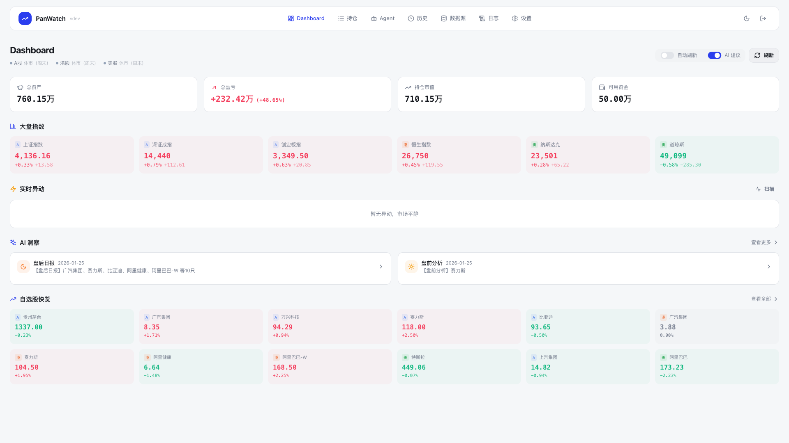
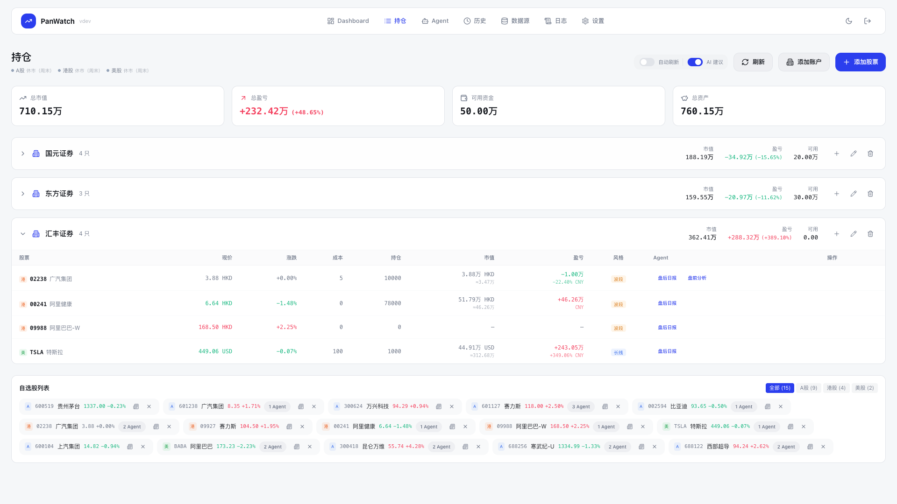
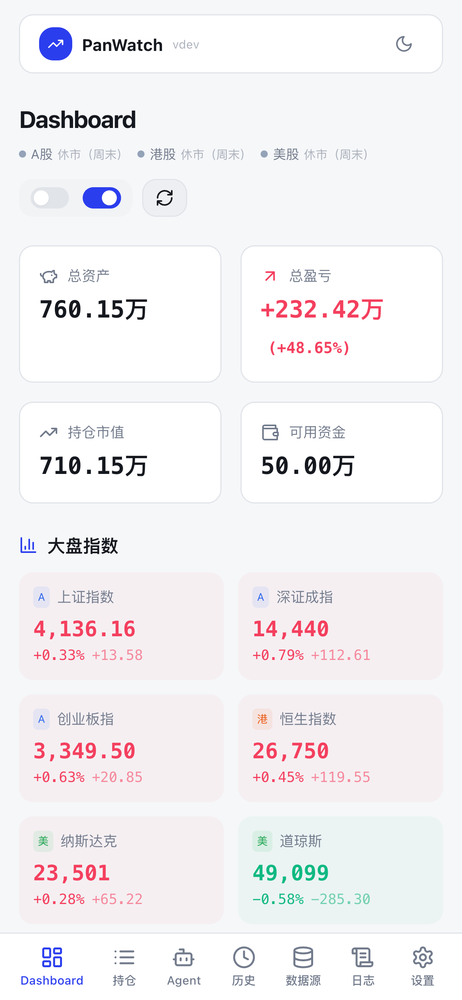

# 盯盘侠 PanWatch

AI 驱动的股票监控助手，支持 A 股、港股、美股。



<details>
<summary>更多截图</summary>

**持仓管理**


**移动端**



</details>

## 功能特点

- **多市场支持**：A 股、港股、美股实时行情
- **智能 Agent**：盘后日报、盘中监测、盘前分析、新闻速递
- **多账户管理**：支持多账户持仓跟踪
- **AI 分析**：接入 OpenAI 兼容 API，智能分析持仓
- **多渠道通知**：Telegram、企业微信、钉钉、飞书等
- **PWA 支持**：可添加到手机桌面使用

## 快速开始

### Docker 部署（推荐）

```bash
# 拉取镜像
docker pull sunxiao0721/panwatch:latest

# 运行容器
docker run -d \
  --name panwatch \
  -p 8000:8000 \
  -v panwatch_data:/app/data \
  sunxiao0721/panwatch:latest

# 访问 http://localhost:8000
```

### Docker Compose

创建 `docker-compose.yml`:

```yaml
version: '3.8'
services:
  panwatch:
    image: sunxiao0721/panwatch:latest
    container_name: panwatch
    ports:
      - "8000:8000"
    volumes:
      - panwatch_data:/app/data
    # environment:
    #   - AUTH_USERNAME=admin       # 可选，预设登录用户名
    #   - AUTH_PASSWORD=password    # 可选，预设登录密码
    restart: unless-stopped

volumes:
  panwatch_data:
```

启动：

```bash
docker-compose up -d
```

## 本地开发

### 环境要求

- Python 3.10+
- Node.js 18+
- pnpm

### 后端

```bash
# 创建虚拟环境
python -m venv venv
source venv/bin/activate  # Windows: venv\Scripts\activate

# 安装依赖
pip install -r requirements.txt

# 启动开发服务器
python server.py
```

### 前端

```bash
cd frontend

# 安装依赖
pnpm install

# 启动开发服务器
pnpm dev
```

前端开发服务器默认运行在 `http://localhost:5173`，会自动代理 API 请求到后端 `http://localhost:8000`。

## 构建镜像

```bash
# 赋予执行权限
chmod +x build.sh

# 构建默认版本 (latest)
./build.sh

# 构建指定版本
./build.sh 1.0.0

# 构建并推送
./build.sh 1.0.0
docker push sunxiao0721/panwatch:1.0.0
docker push sunxiao0721/panwatch:latest
```

## 配置说明

### 环境变量

| 变量名 | 说明 | 默认值 |
|--------|------|--------|
| `AUTH_USERNAME` | 预设登录用户名（可选） | 首次访问时设置 |
| `AUTH_PASSWORD` | 预设登录密码（可选） | 首次访问时设置 |
| `JWT_SECRET` | JWT 签名密钥（可选） | 自动生成随机密钥 |
| `DATA_DIR` | 数据目录 | `./data` |

**Docker 预设账号示例：**

```bash
docker run -d \
  --name panwatch \
  -p 8000:8000 \
  -v panwatch_data:/app/data \
  -e AUTH_USERNAME=admin \
  -e AUTH_PASSWORD=your-password \
  sunxiao0721/panwatch:latest
```

### 首次使用

1. 访问 `http://localhost:8000`
2. 设置用户名和密码（如未通过环境变量预设）
3. 在设置页面配置 AI 服务商（支持 OpenAI 兼容 API）
4. 添加通知渠道（可选）
5. 添加自选股或使用示例股票

## 技术栈

**后端**

- FastAPI
- SQLAlchemy
- APScheduler
- OpenAI SDK

**前端**

- React 18
- TypeScript
- Tailwind CSS
- shadcn/ui

## 贡献

欢迎提交 Issue 和 PR！

如果你想编写自定义 Agent 或数据源，请参考 [贡献指南](CONTRIBUTING.md)。

## License

MIT
